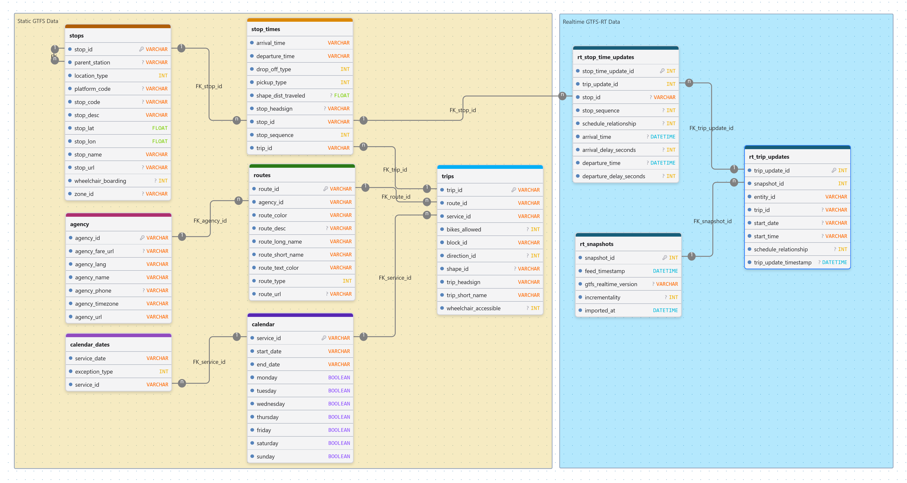
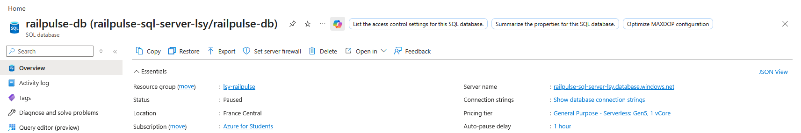

# RailPulse Cloud - Azure Transit Pipeline

Made with


## Project Context

RailPulse Cloud is the second sprint of RailwayPulse, a transit data engineering and analytics platform developed during the AI & Data Science Bootcamp at BeCode.

The wider RailwayPulse project builds a modern hybrid data architecture that ingests, cleans, and transforms both historical schedules (GTFS Static) and live operational streams (GTFS Realtime) from the Belgian National Railway (SNCB/NMBS). The platform is deployed on Microsoft Azure, visualized with Power BI, and later exposed through a conversational Generative AI interface.

This repository focuses on moving the project foundation to Azure. It creates an Azure SQL database, loads the static GTFS structure and data, and deploys a Python Azure Function that regularly ingests SNCB/NMBS GTFS Realtime trip updates into normalized cloud tables.

The goal of this sprint is to build a secure, budget-conscious cloud data warehouse that can support Power BI dashboards.

---

## Learning Objectives

This project covers the following learning objectives:

- Read an open transit API schema and map it to a cloud relational database
- Deploy a Python serverless function through Azure
- Configure basic Azure networking and security constraints
- Keep the cloud project optimized for Azure for Students credits
- Prepare a database foundation for future BI reporting

---

## What This Project Does

The project builds a cloud ETL pipeline for Belgian railway data.

Main flow:

- Create an Azure SQL Database
- Recreate the static GTFS tables
- Import selected GTFS Static files into Azure SQL
- Create realtime GTFS-RT tables
- Fetch and load SNCB/NMBS realtime updates from the [Belgian Mobility API](https://api-management-opendata-production.developer.azure-api.net/) 
- Skip duplicate using feed timestamp
- Run ingestion manually with an HTTP trigger
- Run ingestion automatically with a Timer trigger

---

## Data Sources

The static railway data comes from the Belgian Mobility data portal:

```text
https://data.belgianmobility.io/en/data.html
```

The realtime data is fetched from the SNCB/NMBS GTFS Realtime trip-update endpoint:

```text
https://api-management-opendata-production.azure-api.net/api/gtfs/feed/nmbssncb/rt/trip-update/
```

The realtime endpoint requires a Belgian Mobility partner key. The key is not stored in the repository.

---

## Database Structure


_Made with [drawDB](https://www.drawdb.app/)_

The Azure SQL database is split into two areas.

Static GTFS data:

- `agency`: transit agency information
- `routes`: route names, route types, and agency links
- `stops`: stations, stops, and platform-level stop records
- `trips`: scheduled train journeys
- `stop_times`: planned departure and arrival times for each trip stop
- `calendar`: service IDs and date ranges
- `calendar_dates`: exact active service dates and exceptions

Realtime GTFS-RT data:

- `rt_snapshots`: one row per imported realtime feed snapshot
- `rt_trip_updates`: one row per realtime trip update entity
- `rt_stop_time_updates`: stop-level realtime arrival and departure updates for each trip update

The realtime tables are linked together through foreign keys:

```text
rt_snapshots -> rt_trip_updates -> rt_stop_time_updates
```

The static and realtime areas are connected through the station information:

```text
stops.stop_id -> rt_stop_time_updates.stop_id
```

Trip information can matched when needed for analysis, rather than being permanently linked.

```text
trips.trip_id -> rt_trip_updates.trip_id
```

This is because some realtime trip IDs do not exist in the loaded static GTFS feed.

---

## Project Structure

```text
.
|-- assets/                          # README assets
|-- azure_schema.sql                 # Azure SQL schema for GTFS Static tables
|-- azure_sncb_schema.sql            # Azure SQL schema for GTFS Realtime tables
|-- function_app.py                  # Azure Function HTTP and Timer triggers
|-- host.json                        # Azure Functions host configuration
|-- import_data.py                   # Imports GTFS Static text files into Azure SQL
|-- requirements.txt                 # Python dependencies
|-- README.md                        # Project documentation
```

---

## Azure Setup

The Azure resources were created with Azure for Students and grouped in a single resource group.

Azure SQL was configured for cost control and deployed on a Consumption plan.



Secrets are stored as Azure Function App environment variables.


---

## Function App

The function app contains two triggers:

- HTTP trigger: manually starts ingestion
- Timer trigger: runs automatically every 4 hours

When the function runs, it:

- Requests the SNCB/NMBS GTFS Realtime trip-update feed
- Stores the feed metadata in `rt_snapshots`
- Stores each trip update in `rt_trip_updates`
- Stores each stop-time update in `rt_stop_time_updates`
- Checks whether the feed timestamp already exists
- Skips duplicate snapshots to avoid repeated inserts


---

## Limitations

- The Azure SQL schema is designed for SNCB/NMBS data only.
- GTFS Static and GTFS Realtime trip IDs do not match perfectly, so the trip-level relationship is not enforced as a foreign key.
- The local `static/` GTFS files are not uploaded to the repository.
- Secrets must be configured in Azure or `local.settings.json`.

---

## Timeline

The project was completed over 5 days.

---

## Personal Situation

This project was completed as part of the AI & Data Science Bootcamp at [BeCode](https://becode.org/) in 2026.
